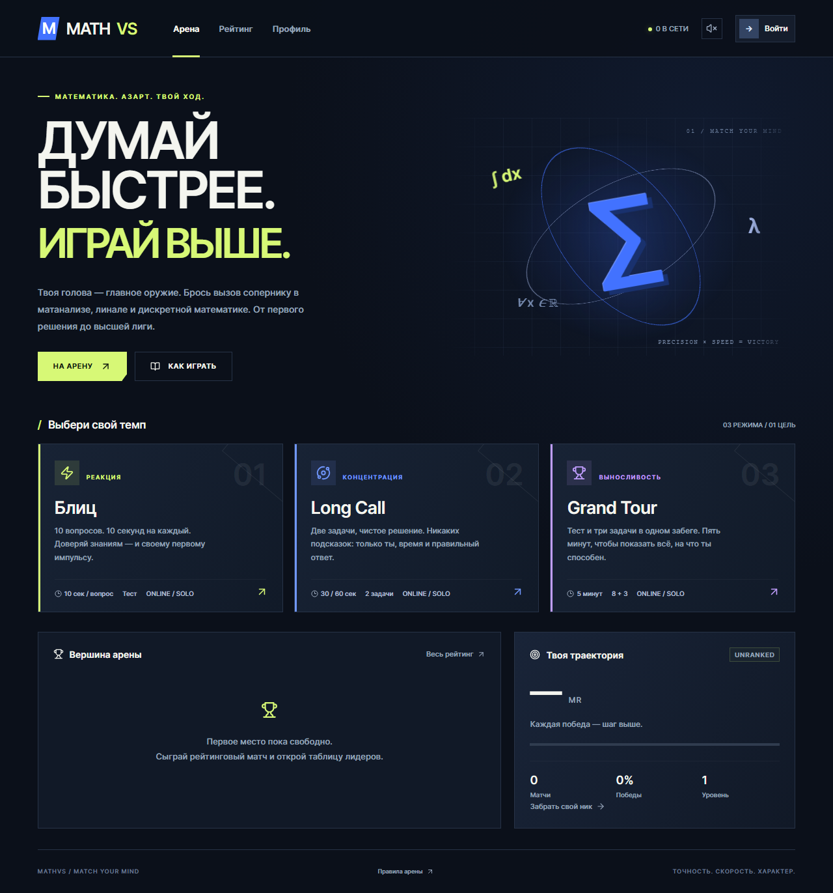

# MATHVS

Соревновательная математическая арена: матанализ, линейная алгебра и дискретная математика. React + Node.js + Socket.IO + SQLite. Интерфейс на русском, оригинальная угловая графика, адаптивная вёрстка, анимации и процедурная музыка через Web Audio.



## Запуск

Нужен Node.js 22.16+ (рекомендуется 24 LTS).

```sh
npm ci
npm run dev
```

Открой **http://localhost:5173**. Vite проксирует API и Socket.IO на сервер :3000.

Production без Docker:

```sh
npm run build
npm start
```

Открой **http://localhost:3000**. Один сервер отдаёт фронтенд, API и онлайн-матчи. База автоматически создаётся в `data/mathvs.db`.

## Docker Compose

```sh
docker compose up -d --build
```

Приложение доступно на **http://localhost:3000**. Контейнер запускается без root, имеет healthcheck и автоматический перезапуск. SQLite хранится в постоянном томе `mathvs-data`.

```sh
docker compose logs -f mathvs
docker compose down
```

`down` сохраняет данные; `down -v` удаляет том и аккаунты. Для изменения порта и домена скопируй `.env.example` в `.env` и укажи `PORT` и `APP_ORIGIN`. Секреты и базы исключены из Git и Docker context.

## Игровые режимы

| Режим      | Задания                     | Время                      |
| ---------- | --------------------------- | -------------------------- |
| Блиц       | 10 вопросов с 4 вариантами  | 10 секунд на каждый        |
| Long Call  | 2 задачи с числовым ответом | 30 или 60 секунд на каждую |
| Grand Tour | 8 вопросов + 3 задачи       | 5 минут на всё             |

Во всех режимах доступны соло, рейтинговая дуэль и приватная комната на двоих. В Grand Tour можно выбирать порядок заданий. В остальных режимах ответ или истечение времени переводит к следующему заданию. Ответ принимается только один раз; пропущенный вопрос считается неверным.

**Правило победы:** больше верных ответов; при равенстве — меньше времени. Разница менее 10 мс считается ничьей. Это правило используется и в Блице: простое прокликивание вариантов не должно выигрывать у точного игрока. При ничьей рейтинг обоих сохраняется.

Оба участника получают одинаковые задания и общий момент старта. Проверка ответов, дедлайны и результат онлайн-матча определяются сервером. Задачи генерируются из параметризованных математических шаблонов: короткие вопросы для Блица и задачи в несколько действий для Long Call/Grand Tour. Числовой ввод принимает целые, десятичные с точкой/запятой и дроби (`3/2`, `-7/4`). Ответы и объяснения раскрываются только после завершения обоими игроками.

### Рейтинг и прогресс

- Аккаунт начинает с **1000 MR**. Общий рейтинг для всех режимов и дисциплин.
- Elo, K=32; изменения симметричны, рейтинг не опускается ниже нуля.
- Тиры: Bronze 0+, Silver 1000+, Gold 1200+, Platinum 1450+, Diamond 1750+, Master 2100+.
- Опыт за рейтинговый матч: 30 XP + 15 за правильный ответ + 50 за победу. За сдачу XP не начисляется.
- Уровень: `floor(sqrt(XP / 100)) + 1`.
- Приватные комнаты и тренировки сохраняют историю, но не меняют рейтинг и XP. История тренировок хранится только на устройстве.

Подбор учитывает режим, дисциплину и время. Допустимая разница рейтинга начинается со 150 MR и расширяется на 15 MR каждую секунду. Очередь ждёт реального соперника. Комната по коду действует 10 минут. При потере связи таймер продолжается; на возвращение даётся 20 секунд. После этого — поражение.

### Офлайн и звук

Офлайн-тренировка доступна после первого открытия **production-сборки**: service worker кэширует интерфейс и ресурсы. Service workers работают на localhost и HTTPS. В development кэширование отключено. Практика не обращается к серверу за заданиями и не выдаётся за рейтинговый матч.

Звук включается кнопкой в шапке: оригинальный синтезированный саундтрек и эффекты кликов/ответов/результата. Автовоспроизведение выключено. Фоновые вкладки не генерируют музыку. Анимации учитывают `prefers-reduced-motion`.

## CI / доставка образа

Workflow [.github/workflows/ci.yml](.github/workflows/ci.yml):

1. На pull request и push в `main`: чистая установка зависимостей, серверные/математические тесты и production-сборка.
2. Затем Chromium E2E: мобильная вёрстка, все режимы, настоящий офлайн и матч двух браузерных аккаунтов.
3. После успешных проверок push в `main` собирает и публикует Docker-образ в **`ghcr.io/bongachiver/mathvs:latest`**, также с тегом `sha-…`.

Используется встроенный `GITHUB_TOKEN` с правом `packages: write`; дополнительных секретов для сборки не нужно. В репозитории должны быть включены GitHub Actions и разрешены используемые actions. Если GHCR-пакет приватный, для скачивания нужен `docker login ghcr.io` с токеном `read:packages`; для публичного доступа измени видимость пакета на Public в GitHub.

Обновление на сервере из опубликованного образа:

```sh
docker compose pull mathvs
docker compose up -d --no-build
```

Публикация образа — автоматическая доставка сборки. Развёртывание на удалённом сервере требует самого сервера и его доступа; workflow не предполагает выдуманного адреса или SSH-ключа.

Для публичного сервера поставь HTTPS reverse proxy с поддержкой WebSocket, настрой `APP_ORIGIN=https://your-domain.example` и `COOKIE_SECURE=1`. `TRUST_PROXY=1` включай только за одним доверенным прокси; ограничь прямой доступ к контейнеру, например `BIND_HOST=127.0.0.1`.

## Проверки

```sh
npm run check
npx playwright install chromium
npm run test:e2e
docker compose config --quiet
```

E2E запускает production-сервер, если :3000 свободен; предварительно нужна `npm run build`. На Linux для браузера может потребоваться `npx playwright install --with-deps chromium`. Тестовая база — `data/e2e.db`. `test-results/` и `playwright-report/` не коммитятся.

## Структура и эксплуатация

```text
src/              React, стили, звук, локальный движок тренировки
shared/game.js    задачи, проверка чисел, правила рейтинга и результата
server/index.js   HTTP API, сессии, защита запросов, Socket.IO
server/arena.js   очередь, комнаты, авторитетный движок матчей
server/store.js   SQLite, аккаунты, рейтинги, история
tests/            математические, серверные и браузерные проверки
public/sw.js      офлайн-кэш production-интерфейса
```

Пароли хэшируются scrypt с отдельной солью; сессии — случайные токены в HttpOnly/SameSite cookie, в базе хранится SHA-256 токена. Есть ограничения HTTP/Socket.IO запросов, проверка Origin, ограничение размера payload и security headers. В открытых профилях нет паролей или токенов.

Реализация рассчитана на **один процесс сервера**. Очереди и активные матчи находятся в памяти; после перезапуска незавершённые матчи прекращаются без рейтинговых изменений. Аккаунты и завершённые матчи сохраняются. Горизонтальное масштабирование потребует общего хранилища матчей и Socket.IO adapter. Восстановления забытого пароля и административной панели пока нет. Серверная проверка не предотвращает использование внешних решателей; античит для крупных турниров — отдельная задача.

Для резервной копии SQLite используй online backup либо останови контейнер перед копированием тома; при WAL нельзя считать копирование только файла `.db` надёжной копией работающей базы.

Лицензия: [MIT](LICENSE).
